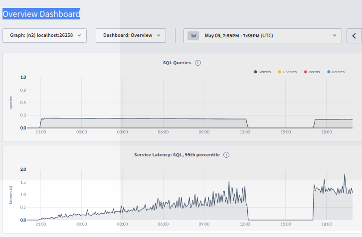
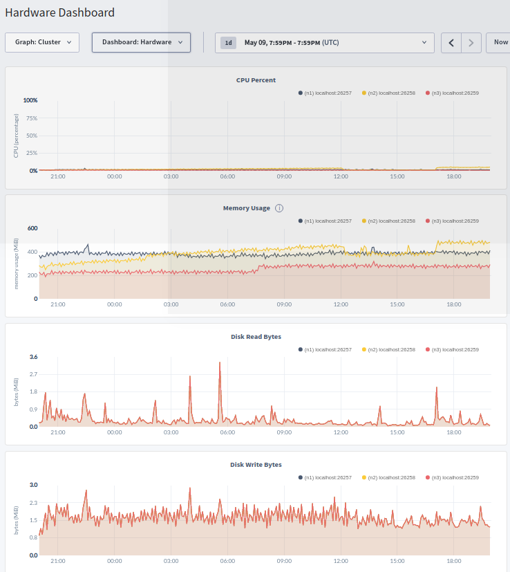
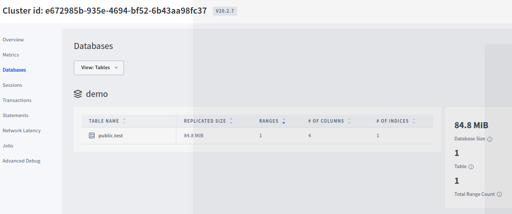
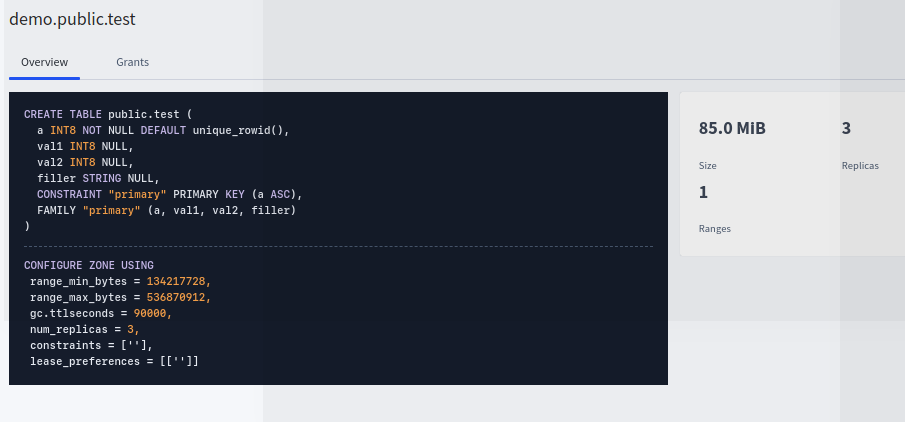
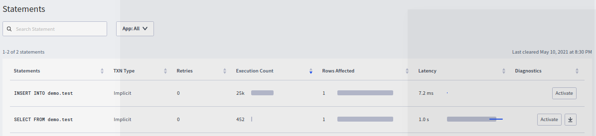
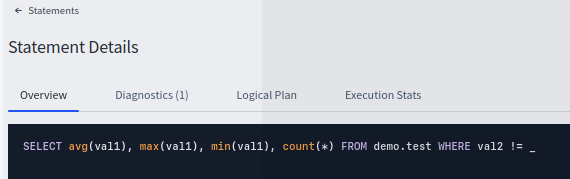
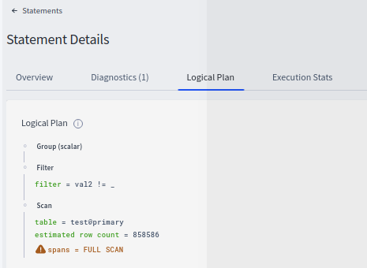
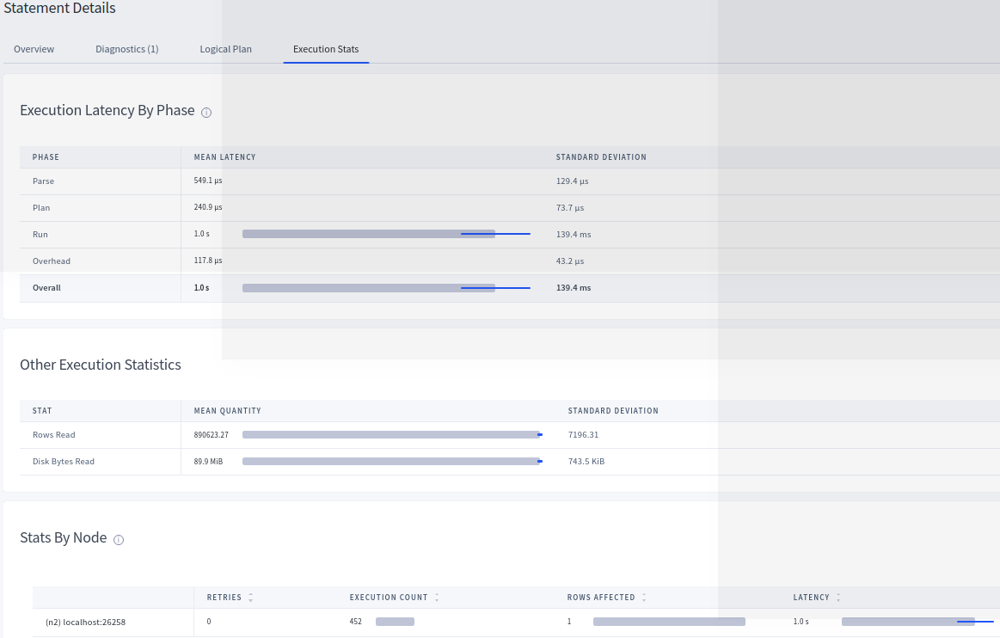
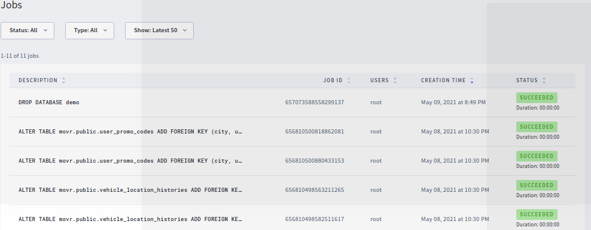

## Introducing the cockroach web-console - part2 


Now I'm running on a three node clster (all the same physical server)

```
pkill -9 cockroach
cockroach start --insecure --store=node1 --listen-addr=localhost:26257 --http-addr=localhost:8080 --join=localhost:26257,localhost:26258,localhost:26259
cockroach start --insecure --store=node2 --listen-addr=localhost:26258 --http-addr=localhost:8081 --join=localhost:26257,localhost:26258,localhost:26259
cockroach start --insecure --store=node3 --listen-addr=localhost:26259 --http-addr=localhost:8082 --join=localhost:26257,localhost:26258,localhost:26259
cockroach init --insecure --host=localhost:26257
cockroach workload init movr
```

Using a simple [demo.test table creation script](create-table.sql)

```
[~/projects/vagrant-centos7-cockroachdb] # cat create-table.sql
create database demo;
SET database = demo;
CREATE TABLE test (a SERIAL PRIMARY KEY, val1 bigint, val2 int, filler string);
```

After creating the demo.test table, we can load 1,000,000 rows data via a simple script (OLTP style) running on localhost:26257

```
[~/projects/vagrant-centos7-cockroachdb] # for i in {1..1000000}; do cockroach sql --host localhost:26257 --insecure -e "insert into demo.test (val1, val2, filler) (select (now()::float*random())::bigint as val1, mod((now()::float*random())::bigint,512) as val2, 'blah12345678901234567890123456789012345678901234567890blah12' as filler);";done
INSERT 1

Time: 9ms

INSERT 1

Time: 11ms

INSERT 1

Time: 11ms

INSERT 1

Time: 5ms

INSERT 1

Time: 4ms

INSERT 1

Time: 7ms

...
```


and another script running reporting-style (OLAP) queries via localhost:26258

```
[~/projects/vagrant-centos7-cockroachdb] # for i in {1..10000}; do cockroach sql --host localhost:26258 --insecure -e "select avg(val1),max(val1),min(val1),count(*) from demo.test where val2 <> 7";sleep 5;done
           avg          |    max     |  min   | count
------------------------+------------+--------+--------
  810909780.57937732595 | 1620406197 | 171740 | 11017
(1 row)

Time: 31ms

           avg          |    max     |  min   | count
------------------------+------------+--------+--------
  810648723.66431797651 | 1620406197 | 171740 | 11070
(1 row)

Time: 15ms

           avg          |    max     |  min   | count
------------------------+------------+--------+--------
  810440936.21756720309 | 1620406197 | 171740 | 11123
(1 row)

Time: 14ms
```
and in a third session, I tracked load averages and du (disc usage) by node 
```
[~/projects/vagrant-centos7-cockroachdb] # for i in {1..100000};do uptime;du -hs node*;sleep 60;done
 23:03:02 up 134 days, 11:55,  7 users,  load average: 5,61, 4,82, 3,48
252M	node1
324M	node2
325M	node3
...
 20:44:21 up 135 days,  9:37,  7 users,  load average: 3,01, 3,49, 3,79
337M	node1
399M	node2
400M	node3
...
 22:19:59 up 135 days, 11:12,  8 users,  load average: 5,58, 4,96, 4,28
343M	node1
405M	node2
405M	node3
```


As per the course 

> Overview, metrics, databases, statements and jobs.
The metrics **overview dashboard** lets you monitor important SQL performance, replication, and storage metrics.
It displays time series graphs for SQL queries, service latency, replicas per node and storage capacity.
You can use the drop downs at the top to show different cluster metrics.
You can see metrics for your cluster or for just one of the nodes.
You can also find lots of different and useful metrics dashboards.<br/>
An important one is a **hardware dashboard** which lets you monitor CPU usage, disk throughput, network traffic, storage capacity and memory.
It's important to note that these graphs show the hardware consumption by the CockroachDB process only, and you can also toggle between different time periods for which to view metrics.<br/>
The **databases page** of the Admin UI provides details of the databases configured, the tables in each database and the grants assigned to each user.
If you click on a table on the database, the table schema displays.<br/>
Schema information, like whether there are indexes configured or if the table is partitioned, are shown here through the table's DML.<br/>
The **statements page** helps you identify frequently executed or high latency sequel statements.
It also allows you to view the details of an individual sequel statement by clicking on the statement to view the statement details page.
On the statement details page, you can view the logical plan for the statement as well as the breakdown of the phases for executing the statement.<br/>
These can expose opportunities for query performance tuning, and lastly, the **jobs page** provides details about the backup restore jobs, schema changes, user-created table statistics and automatic table statistics jobs, and change feeds performed across all the nodes in the cluster.


So reviewing the above 

* **Overview Dashboard** - "OLTP style node" localhost-26257 


* **Overview Dashboard** - "OLAP style node" localhost-26258 



* **Hardware dashboard** (cluster and node levels are identical - as all three nodes are on the same physical machine) CPU usage, disk throughput, network traffic, storage capacity and memory.




* **databases page** - top level



* **databases page** - drill into databases table details



* **statements page** - overview




* **statements - individual query analysis** - overview



* **statements - individual query analysis** - logical plan



* **statements - individual query analysis** - execution stats



* **jobs page**

