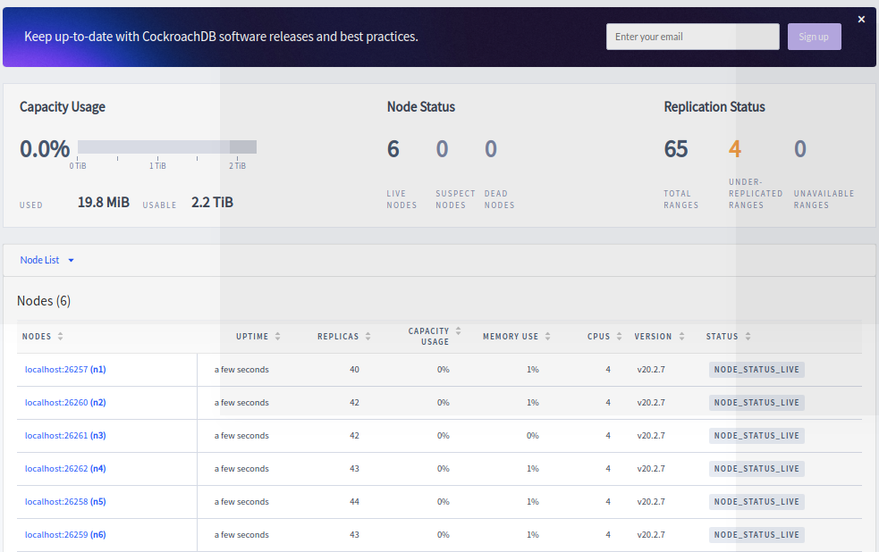
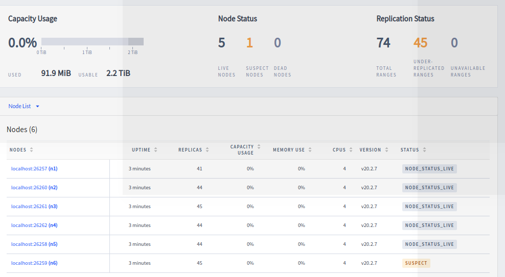
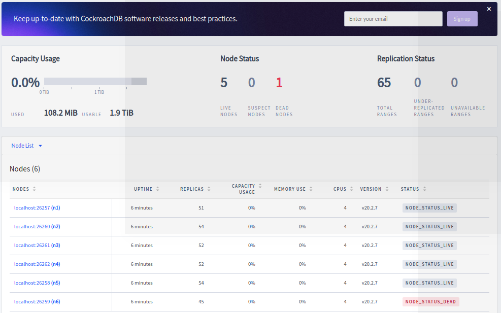

# Starting a 6 node cluster and dead-node rebalancing

Demo running 6 node cluster, killing a node and subsequent rebalancing...

## Initial setup

```
[~/projects/vagrant-centos7-cockroachdb] # cat start_cluster_6nodes.sh 
#!/bin/bash

pkill -9 cockroach
# https://www.cockroachlabs.com/docs/v20.2/start-a-local-cluster
# node1


mkdir -p node1
mkdir -p node2
mkdir -p node3
mkdir -p node4
mkdir -p node5
mkdir -p node6

cockroach start --insecure --background --store=node1 --listen-addr=localhost:26257 --http-addr=localhost:8080 --join=localhost:26257,localhost:26258,localhost:26259,localhost:26260,localhost:26261,localhost:26262
cockroach start --insecure --background --store=node2 --listen-addr=localhost:26258 --http-addr=localhost:8081 --join=localhost:26257,localhost:26258,localhost:26259,localhost:26260,localhost:26261,localhost:26262
cockroach start --insecure --background --store=node3 --listen-addr=localhost:26259 --http-addr=localhost:8082 --join=localhost:26257,localhost:26258,localhost:26259,localhost:26260,localhost:26261,localhost:26262
cockroach start --insecure --background --store=node4 --listen-addr=localhost:26260 --http-addr=localhost:8083 --join=localhost:26257,localhost:26258,localhost:26259,localhost:26260,localhost:26261,localhost:26262
cockroach start --insecure --background --store=node5 --listen-addr=localhost:26261 --http-addr=localhost:8084 --join=localhost:26257,localhost:26258,localhost:26259,localhost:26260,localhost:26261,localhost:26262
cockroach start --insecure --background --store=node6 --listen-addr=localhost:26262 --http-addr=localhost:8085 --join=localhost:26257,localhost:26258,localhost:26259,localhost:26260,localhost:26261,localhost:26262
cockroach init --insecure --host=localhost:26257
cockroach sql --execute="SET CLUSTER SETTING server.time_until_store_dead = '1m15s';" --insecure

cockroach workload init movr
```

Checking http://localhost:8080/#/overview/list we can see the 6node-cluster and some initial range-balancing (this went to zero fairly quickly)




## killing a node

As above

```
[~/projects/vagrant-centos7-cockroachdb] # cockroach node status --insecure
  id |     address     |   sql_address   |  build  |            started_at            |            updated_at            | locality | is_available | is_live
-----+-----------------+-----------------+---------+----------------------------------+----------------------------------+----------+--------------+----------
   1 | localhost:26257 | localhost:26257 | v20.2.7 | 2021-05-17 18:25:22.125002+00:00 | 2021-05-17 18:25:40.18094+00:00  |          | true         | true
   2 | localhost:26260 | localhost:26260 | v20.2.7 | 2021-05-17 18:25:24.236714+00:00 | 2021-05-17 18:25:37.813451+00:00 |          | true         | true
   3 | localhost:26261 | localhost:26261 | v20.2.7 | 2021-05-17 18:25:24.792514+00:00 | 2021-05-17 18:25:38.368293+00:00 |          | true         | true
   4 | localhost:26262 | localhost:26262 | v20.2.7 | 2021-05-17 18:25:25.646586+00:00 | 2021-05-17 18:25:39.209205+00:00 |          | true         | true
   5 | localhost:26258 | localhost:26258 | v20.2.7 | 2021-05-17 18:25:22.682081+00:00 | 2021-05-17 18:25:40.75287+00:00  |          | true         | true
   6 | localhost:26259 | localhost:26259 | v20.2.7 | 2021-05-17 18:25:23.411608+00:00 | 2021-05-17 18:25:41.485236+00:00 |          | true         | true
(6 rows)
[~/projects/vagrant-centos7-cockroachdb] # ps -ef|grep cockroach
dpitts   30620  3781 10 20:25 pts/54   00:00:03 cockroach start --insecure --store=node1 --listen-addr=localhost:26257 --http-addr=localhost:8080 --join=localhost:26257,localhost:26258,localhost:26259,localhost:26260,localhost:26261,localhost:26262
dpitts   30647  3781  9 20:25 pts/54   00:00:03 cockroach start --insecure --store=node2 --listen-addr=localhost:26258 --http-addr=localhost:8081 --join=localhost:26257,localhost:26258,localhost:26259,localhost:26260,localhost:26261,localhost:26262
dpitts   30676  3781 12 20:25 pts/54   00:00:04 cockroach start --insecure --store=node3 --listen-addr=localhost:26259 --http-addr=localhost:8082 --join=localhost:26257,localhost:26258,localhost:26259,localhost:26260,localhost:26261,localhost:26262
dpitts   30706  3781 11 20:25 pts/54   00:00:03 cockroach start --insecure --store=node4 --listen-addr=localhost:26260 --http-addr=localhost:8083 --join=localhost:26257,localhost:26258,localhost:26259,localhost:26260,localhost:26261,localhost:26262
dpitts   30737  3781 14 20:25 pts/54   00:00:04 cockroach start --insecure --store=node5 --listen-addr=localhost:26261 --http-addr=localhost:8084 --join=localhost:26257,localhost:26258,localhost:26259,localhost:26260,localhost:26261,localhost:26262
dpitts   30765  3781 14 20:25 pts/54   00:00:04 cockroach start --insecure --store=node6 --listen-addr=localhost:26262 --http-addr=localhost:8085 --join=localhost:26257,localhost:26258,localhost:26259,localhost:26260,localhost:26261,localhost:26262
dpitts   30877  7551  0 20:25 pts/54   00:00:00 grep cockroach
```

and killing a node

```
[~/projects/vagrant-centos7-cockroachdb] # kill 30676
[~/projects/vagrant-centos7-cockroachdb] # initiating graceful shutdown of server
server drained and shutdown completed
^C
[~/projects/vagrant-centos7-cockroachdb] # kill -9 30676
bash: kill: (30676) - No such process
[~/projects/vagrant-centos7-cockroachdb] # cockroach node status --insecure
  id |     address     |   sql_address   |  build  |            started_at            |            updated_at            | locality | is_available | is_live
-----+-----------------+-----------------+---------+----------------------------------+----------------------------------+----------+--------------+----------
   1 | localhost:26257 | localhost:26257 | v20.2.7 | 2021-05-17 18:25:22.125002+00:00 | 2021-05-17 18:26:20.666254+00:00 |          | true         | true
   2 | localhost:26260 | localhost:26260 | v20.2.7 | 2021-05-17 18:25:24.236714+00:00 | 2021-05-17 18:26:22.80656+00:00  |          | true         | true
   3 | localhost:26261 | localhost:26261 | v20.2.7 | 2021-05-17 18:25:24.792514+00:00 | 2021-05-17 18:26:23.348558+00:00 |          | true         | true
   4 | localhost:26262 | localhost:26262 | v20.2.7 | 2021-05-17 18:25:25.646586+00:00 | 2021-05-17 18:26:24.205475+00:00 |          | true         | true
   5 | localhost:26258 | localhost:26258 | v20.2.7 | 2021-05-17 18:25:22.682081+00:00 | 2021-05-17 18:26:21.240407+00:00 |          | true         | true
   6 | localhost:26259 | localhost:26259 | v20.2.7 | 2021-05-17 18:25:23.411608+00:00 | 2021-05-17 18:26:09.988395+00:00 |          | false        | false
(6 rows)
[~/projects/vagrant-centos7-cockroachdb]
```
we can now see some range balancing issues





## rebalancing after node is dead for over 1 min 15 seconds

The default is 5 mins:

```
cockroach sql --execute="SET CLUSTER SETTING server.time_until_store_dead = '1m15s';" --insecure
```

but for the exercise we dropped this to 75 seconds ^^

After 75 seconds cockroach starts rebalancing and there was a steady decrease to 0 



