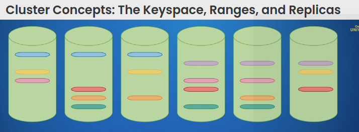

## Cluster Concepts: The Keyspace, Ranges, and Replicas

A few details I have selected from the course....

### Keynotes from this core-concepts lecture:

>The important thing is that everything we can use to find a record including the primary key are all part of the Keyspace.
The rest of the row's columns are typically put into the value part of the KV store and don't affect the ordering.
So the key spaces all of this with additional metadata all together in a Grand Ordered data structure, for a single node cluster the **Keyspace** is a fairly accurate description of how the **data is actually organized by the storage layer**.
But in a production cluster, the implementation gets complicated. 
The reason why it's a useful abstraction is because the **cluster divides the Keyspace into what we call ranges**.
When a range grows beyond a certain limit megabytes by default, it gets split into two.
When those grow each gets split again and so on.
splits can also occur for other reasons, but ranges are important because they are the units that CockroachDB replicates and distributes to the nodes of the cluster. 
Here's a visualization showing some data getting divided up into seven ranges represented by flat ovals and six nodes for our cluster: 

> Represented by the cylinders.
**Multiple copies** of each range called **replicas** are distributed among the nodes to keep the cluster balanced.
In CockroachDB, the default replication factor is three.
and that's what we see here, three replicas of each range.
Moreover, each replica is always on a different node, they never double up, we can increase the replication factor to larger odd numbers, such as five or seven to increase the resiliency. 

### Conclusion 

> So let's review...
We learned that CockroachDB takes the **Keyspace** and divides it up into **ranges**, that it then makes **copies** of those ranges called **replicas** up to a **replication factor**, and that it distributes those replicas among the nodes of the cluster.

