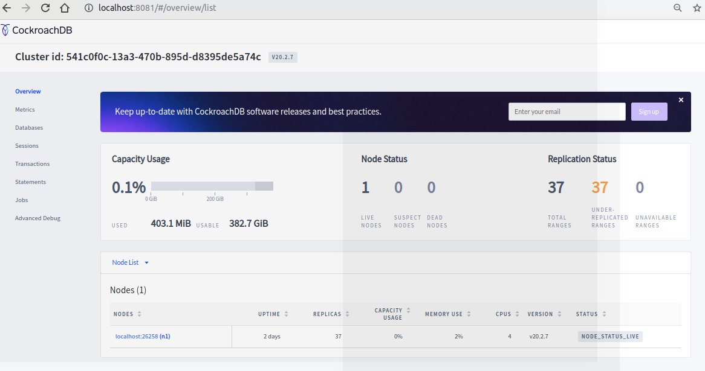
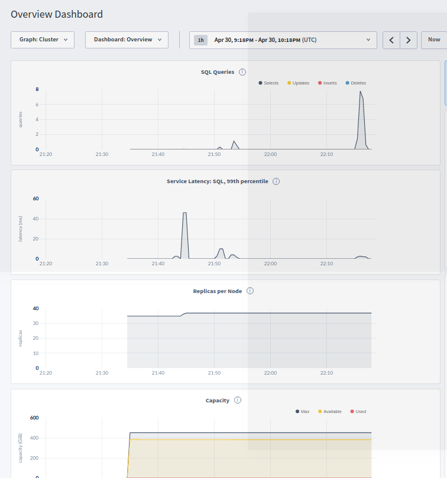
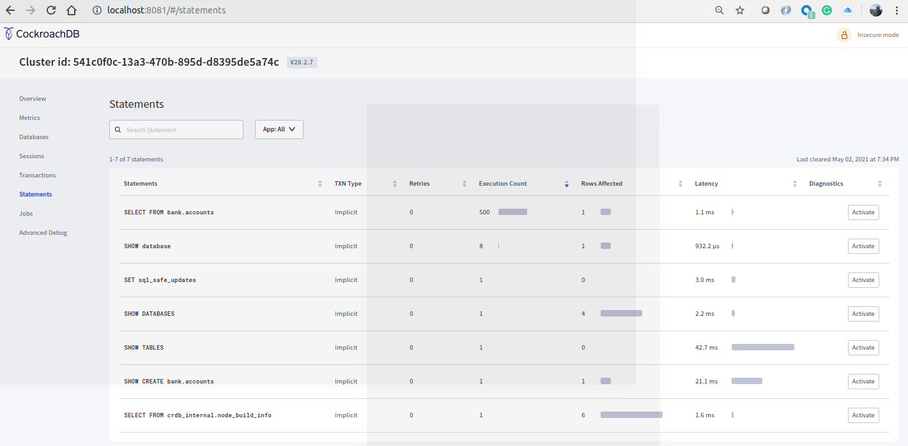

## Introducing the cockroach web-console 

I was having some problems with the web console and the vagrant port forwarding (still researching 'Connection reset by peer' errors). So locally on my ubuntu laptop, I started a single node cluster andshortly after his I could revie the cluster config via http://localhost:8081



```
cockroach start --insecure --join=localhost:26257,localhost:26258,localhost:26259 --listen-addr localhost:26258 --http-addr localhost:8081 --store=cockroach-data-2 --background
```

```
cockroach sql --insecure --host=localhost:26258 < echo 'select count(*) from bank.accounts;'
```

As per the cockroachdb entry level training "Practical First Steps with CockroachDB" https://university.cockroachlabs.com/course/practical-first-steps

```
[~/projects/local-cockroachdb] # cat transaction_setup.sql
CREATE DATABASE bank;
CREATE TABLE bank.customers (
    customer_id INT8 PRIMARY KEY, name STRING, address STRING
);

INSERT
  INTO bank.customers
VALUES (1, 'Petee', '101 5th Ave, New York, NY 10003'),
       (2, 'Carl', NULL),
       (3, 'Lola', NULL),
       (
        4,
        'Ernie',
        '1600 Pennsylvania Ave NW, Washington, DC 20500'
       );

CREATE TABLE bank.accounts (
    type        STRING,
    balance     DECIMAL(8,2),
    customer_id INT8 REFERENCES bank.customers (customer_id)
);

INSERT
  INTO bank.accounts
VALUES ('checking', 0.00, 1),
       ('checking', 250.00, 2),
       ('savings', 314.15, 2),
       ('savings', 42000.00, 4);
```

runnig the above script
```
cockroach sql --insecure --host=localhost:26258 < transaction_setup.sql
```

and next generate a little query load

```
[~/projects/local-cockroachdb] # cat test_query1.sql 
select count(*) from bank.accounts;
```

and 500 back-to-back execs of this

```
uptime;for i in {1..500};do cockroach sql --insecure --host=localhost:26258 < test_query1.sql;done;uptime
```

Now from http://localhost:8081/#/metrics/overview/cluster we can see a connection spike




also from the statement overview page http://localhost:8081/#/statements



