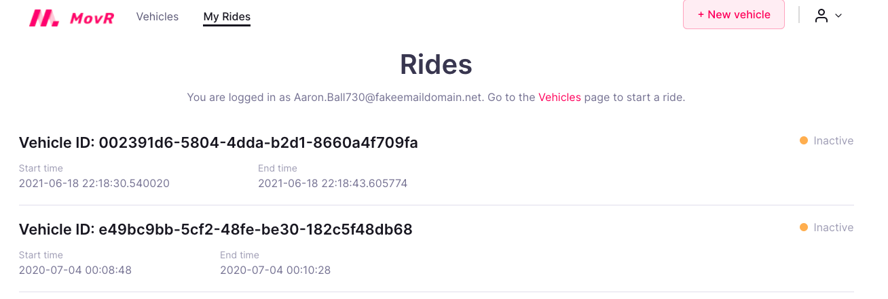

## Users and Rides Model and Transaction Handlers


## Background initial cockroachDB setpu

Wishing the movr/lab_users folder - run the db-setup.sh (specific for this lab)

```
(env) ~/projects/vagrant-centos7-cockroachdb/movr/lab_users $ ./db-setup.sh  'postgres://root@localhost:26257/movr?sslmode=disable'
Using connection string [postgres://root@localhost:26257/movr?sslmode=disable]
Executing [./dbinit.sql]
Loading [./../data/vehicles_data.sql]
Loading [./../data/location_history_data.sql]
Loading [./../data/users_data.sql]
Loading [./../data/rides_data.sql]
Database setup for this lab is complete.
For details, view db-setup.log
```

## Model setup

Next add the two missing models in the SQLAchemey ORM python code 


```
(env) ~/projects/vagrant-centos7-cockroachdb/movr/lab_users $ git diff movr_py_users/movr/models.py
diff --git a/movr/lab_users/movr_py_users/movr/models.py b/movr/lab_users/movr_py_users/movr/models.py
index 5106e09..0b018a7 100644
--- a/movr/lab_users/movr_py_users/movr/models.py
+++ b/movr/lab_users/movr_py_users/movr/models.py
@@ -68,6 +68,13 @@ class User(Base, UserMixin):
     # LAB: UPDATE MOVR FOR USERS AND RIDES.
     # UPDATE HERE WITH NEW SCHEMA (CHECK THE DATABASE)

+    __tablename__ = 'users'
+    email = Column(String)
+    last_name = Column(String)
+    first_name = Column(String)
+    phone_numbers = Column(ARRAY(String))
+    PrimaryKeyConstraint(email)
+
     def get_id(self):
         """
         Required by flask_login.
@@ -84,7 +91,6 @@ class User(Base, UserMixin):
 class Ride(Base):
     """
     Stores information about rides.
-
     Arguments:
         Base {DeclarativeMeta} -- Base class for declarative SQLAlchemy class
                 that produces appropriate `sqlalchemy.schema.Table` objects.
@@ -93,6 +99,14 @@ class Ride(Base):
     # LAB: UPDATE MOVR FOR USERS AND RIDES.
     # UPDATE HERE WITH NEW SCHEMA (CHECK THE DATABASE)

+    __tablename__ = 'rides'
+    id = Column(UUID)
+    vehicle_id = Column(UUID, ForeignKey('vehicles.id'))
+    user_email = Column(String, ForeignKey('users.email'))
+    start_ts = Column(DateTime)
+    end_ts = Column(DateTime)
+    PrimaryKeyConstraint(id)
+
     def __repr__(self):
         return (("<Ride(id='{0}', vehicle_id='{1}', user_email='{2}', "
                  "start_ts='{3}', end_ts='{4}')>"
```

## Transaction handling

We also need some transaction handling (“add user”) code  
```
(env) ~/projects/vagrant-centos7-cockroachdb/movr/lab_users $ git diff movr_py_users/movr/transactions.py
diff --git a/movr/lab_users/movr_py_users/movr/transactions.py b/movr/lab_users/movr_py_users/movr/transactions.py
index 2500719..015c388 100644
--- a/movr/lab_users/movr_py_users/movr/transactions.py
+++ b/movr/lab_users/movr_py_users/movr/transactions.py
@@ -459,6 +459,12 @@ def add_user_txn(session, email, last_name, first_name, phone_numbers):
     # YOU MAY WANT TO CONSULT THE SQLALCHEMY DOCUMENTATION FOR THIS METHOD:
     # https://docs.sqlalchemy.org/en/13/orm/session_api.html#sqlalchemy.orm.session.Session.add

+    user = User(email=email,
+                last_name=last_name,
+                first_name=first_name,
+                phone_numbers=phone_numbers)
+    session.add(user)
+
     return True
```

## Demo time

Finally work through the exercises to add rides and users



