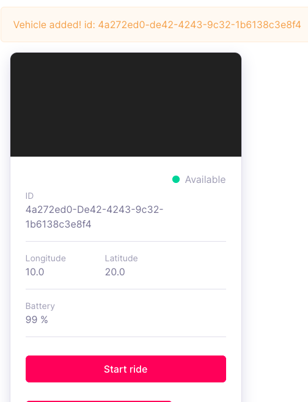

## Reviewing sqlalchemy.engine activity and echo SQL statements

### Set echo=True for sqlalchemy.engine.engine

```
(env) ~/projects/vagrant-centos7-cockroachdb/movr/lab_add_vehicle/movr_py_add_vehicle $ diff movr/movr.py movr/movr.py.orig

29c28
<         self.engine = create_engine(conn_string, convert_unicode=True, echo=True)
---
>         self.engine = create_engine(conn_string, convert_unicode=True)
```

### Restart server and use tee to capture logs 

NB I'm using iTerm2 and had to use tee to capture the logs (otherwise they disappear in a strange fashion)

```
(env) ~/projects/vagrant-centos7-cockroachdb/movr/lab_add_vehicle/movr_py_add_vehicle $ ./server.py run --url 'postgres://root@localhost:26257/movr?sslmode=disable' | tee -a server.log
  Input Password:
2021-06-09 21:16:27,255 INFO sqlalchemy.engine.Engine select current_schema()
2021-06-09 21:16:27,255 INFO sqlalchemy.engine.Engine [raw sql] {}
2021-06-09 21:16:27,272 INFO sqlalchemy.engine.Engine select version()
2021-06-09 21:16:27,273 INFO sqlalchemy.engine.Engine [raw sql] {}
 * Serving Flask app 'server' (lazy loading)
 * Environment: production
   WARNING: This is a development server. Do not use it in a production deployment.
   Use a production WSGI server instead.
 * Debug mode: off
 * Running on http://127.0.0.1:36257/ (Press CTRL+C to quit)
```

after this I created a vehicle 

### create-vehicle-4a272ed0-de42-4243-9c32-1b6138c3e8f4

Here is a screen shoot of the new vehicle 



### sqlalchemy.engine.Engine Transaction around INSERT INTO vehicle
and here is the code:

```
2021-06-09 20:58:09,199 INFO sqlalchemy.engine.Engine BEGIN (implicit)
2021-06-09 20:58:09,200 INFO sqlalchemy.engine.Engine SAVEPOINT cockroach_restart
2021-06-09 20:58:09,200 INFO sqlalchemy.engine.Engine [raw sql] {}
2021-06-09 20:58:09,209 INFO sqlalchemy.engine.Engine INSERT INTO vehicles (id, last_longitude, last_latitude, last_checkin, in_use, vehicle_type, battery) VALUES (%(id)s, %(last_longitude)s, %(last_latitude)s, now(), %(in_use)s, %(vehicle_type)s, %(battery)s)
2021-06-09 20:58:09,209 INFO sqlalchemy.engine.Engine [dialect cockroachdb+psycopg2 does not support caching 0.00033s] {'id': UUID('4a272ed0-de42-4243-9c32-1b6138c3e8f4'), 'last_longitude': Decimal('10'), 'last_latitude': Decimal('20'), 'in_use': False, 'vehicle_type': 'scooter', 'battery': 99}
2021-06-09 20:58:09,215 INFO sqlalchemy.engine.Engine RELEASE SAVEPOINT cockroach_restart
2021-06-09 20:58:09,216 INFO sqlalchemy.engine.Engine [raw sql] {}
2021-06-09 20:58:09,239 INFO sqlalchemy.engine.Engine COMMIT
```